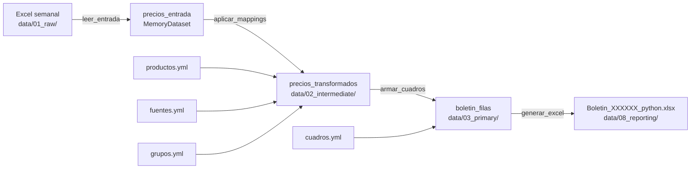

# Flujo de Datos — Extremo a Extremo

## Fuente de datos

Cada semana, el equipo de recolección envía un archivo Excel con los precios
reportados en los mercados mayoristas. Este archivo es la única entrada del pipeline.

**Formato esperado:** `.xlsx` con las columnas:

| Columna  | Tipo    | Descripción                                         |
|----------|---------|-----------------------------------------------------|
| Grupo    | string  | Nombre del grupo de alimentos (ej. "Verduras")      |
| Producto | string  | Nombre del producto (ej. "Acelga")                  |
| Fuente   | string  | Nombre del mercado (ej. "Bogotá, Corabastos")       |
| Min(1)   | float   | Precio mínimo de la semana actual                   |
| Max(1)   | float   | Precio máximo de la semana actual                   |
| P(1)     | float   | Precio medio de la semana actual                    |
| P(-1)    | float   | Precio medio de la semana anterior                  |
| Var(1)   | float   | Variación porcentual                                |
| Tend     | string  | Tendencia (`↑`, `↓`, `→` o vacío)                  |

Volumen típico: ~4,486 filas por semana.

## Diagrama del pipeline

## Paso a paso

### 1. Ingesta — Bronze a Silver

**Nodo:** `leer_entrada`
**Entrada:** `data/01_raw/Listado a DD mmm AA.xlsx`
**Salida:** `precios_entrada` (MemoryDataset, no persiste en disco)

- Lee el Excel con `pandas.read_excel`.
- Valida que existan las 9 columnas requeridas.
- Elimina filas completamente vacías.
- Normaliza tipos: columnas de precio → `float64`, `Tend` → `string`.

### 2. Transformación — Silver

**Nodo:** `aplicar_mappings`
**Entrada:** `precios_entrada` + 3 mappings YAML
**Salida:** `data/02_intermediate/precios_transformados.csv`

- Cruza cada `Producto` con `productos.yml` → columna `Rproducto` (int).
- Cruza cada `Fuente` con `fuentes.yml` → columna `RFuente` (int, nullable).
- Cruza cada `Grupo` con `grupos.yml` → columna `RGrupo` (int).
- **Descarta** las filas con `Rproducto` nulo (productos fuera del catálogo).
- Emite `WARNING` en consola para productos y fuentes sin código.

Resultado: ~4,484 filas con los 3 códigos numéricos.

### 3. Agregación — Silver a Gold

**Nodo:** `armar_cuadros`
**Entrada:** `precios_transformados` + `mapping_productos` + `cuadros.yml`
**Salida:** `data/03_primary/boletin_filas.csv`

Para cada cuadro (1–8), en el orden definido en `cuadros.yml`:
1. Fila de título del cuadro (`_tipo = "cuadro"`).
2. Fila de cabecera de columnas (`_tipo = "columnas"`, excepto Cuadro 1).
3. Para cada producto con datos en la semana:
   - Fila de nombre del producto (`_tipo = "producto"`).
   - Una fila por mercado (`_tipo = "dato"`), ordenadas por código RFuente.
   - Fila separadora vacía (`_tipo = "separador"`).

Los productos sin datos en la semana se omiten automáticamente.

Resultado: ~5,179 filas totales (idéntico al SAS).

### 4. Reporte — Gold

**Nodo:** `generar_excel`
**Entrada:** `boletin_filas` + `fecha` + `ruta_salida`
**Salida:** `data/08_reporting/Boletin_{fecha}_python.xlsx`

- Crea un `Workbook` de openpyxl.
- Itera fila a fila del DataFrame y delega el renderizado a la estrategia correspondiente.
- Aplica estilos (fuente, alineación, formato de número).
- Fija la primera fila al hacer scroll (`freeze_panes`).
- Ajusta anchos de columna.

## Resultados verificados

Comparado contra el boletín SAS de la semana del 27 de febrero de 2026:

| Métrica               | Python    | SAS       |
|-----------------------|-----------|-----------|
| Filas totales         | 5,179     | 5,179     |
| Filas con precios     | 4,484     | 4,484     |
| Tiempo de ejecución   | ~5–6 seg  | ~30 seg   |

## Diferencias conocidas con el SAS (intencionales)

- **Mercados sin código**: en el SAS aparecían *antes* del encabezado del producto
  (artefacto del sort de valores nulos en SAS). En Python aparecen *después* de los
  mercados codificados — comportamiento más legible y correcto semánticamente.
- **Formato Excel**: estilos aplicados con openpyxl en lugar de la macro VBA.
  El contenido analítico (precios, productos, mercados, tendencias) es idéntico.
